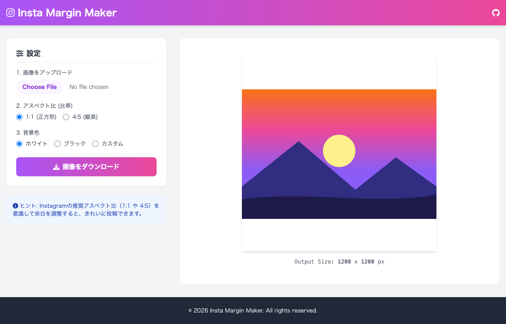

# Insta Margin Maker 📸

Instagramの投稿向けに、写真のトリミング（切り抜き）なしで最適なアスペクト比の余白（マージン）を追加できるブラウザ完結型の画像編集ツールです。

[](https://ut0s.github.io/InstaMarginMaker/)
[](LICENSE)

---

## 🌟 スクリーンショット / デモ



---

## ✨ 主な特徴

- 📐 **Instagram最適化アスペクト比**
  - **1:1 (正方形)**: フィード投稿の定番サイズ
  - **4:5 (縦長)**: スマートフォン画面いっぱいに表示できる人気サイズ
- 🎨 **柔軟な背景色カスタマイズ**
  - ホワイト / ブラックのワンクリック選択
  - 任意のカラーピッカー対応
  - **スポイト機能**: EyeDropper API または画像上クリックにより、画像内の色を抽出して背景色に設定可能
- 🔒 **プライバシー・セキュリティ重視**
  - すべての処理はブラウザ内の HTML5 Canvas API で実行されます
  - 画像データが外部サーバーに送信・アップロードされることは一切ありません
- ⚡ **超軽量 & インストール不要**
  - 単一の HTML ファイル（+ Tailwind CSS CDN / Font Awesome CDN）で構成
  - ブラウザで開くだけで即座に使用可能
- 💾 **高解像度出力**
  - 元画像の解像度を維持したまま余白を付加し、ワンクリックで PNG ダウンロード

---

## 🚀 使い方

1. **アクセス / 起動**:
   - [GitHub Pages デモサイト](https://ut0s.github.io/InstaMarginMaker/) にアクセスするか、ローカルの `index.html` をブラウザで開きます。
2. **画像をアップロード**:
   - 「Choose File」から加工したい写真を選択します。
3. **比率と背景色を設定**:
   - アスペクト比（1:1 または 4:5）を選択します。
   - 背景色（ホワイト、ブラック、カスタム、スポイト）を設定します。
4. **ダウンロード**:
   - 「画像をダウンロード」ボタンを押して、余白付き画像を保存します。

---

## 💻 ローカルでの実行

ビルド手順は不要です。ブラウザで直接開くか、ローカルサーバーを起動して確認できます。

### 方法1: ブラウザで直接開く
`index.html` をダブルクリックして任意のブラウザで開きます。

### 方法2: ローカルサーバー経由（Python）
```bash
python3 -m http.server 8000
```
ブラウザで `http://localhost:8000` にアクセスします。

---

## 🛠 使用技術

- HTML5 (Canvas API, EyeDropper API, FileReader API)
- CSS (Tailwind CSS CDN)
- JavaScript (Vanilla JS)
- Font Awesome (アイコン)

---

## 📄 ライセンス

このプロジェクトは [MIT License](LICENSE) のもとで公開されています。
